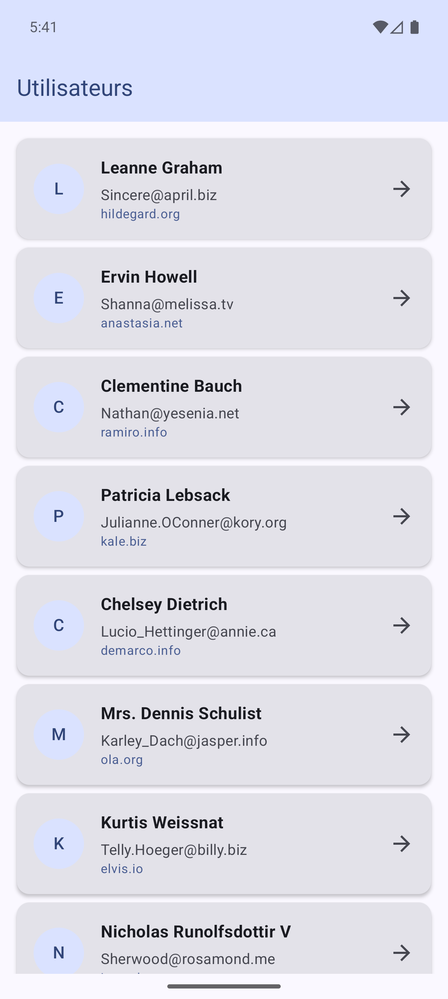
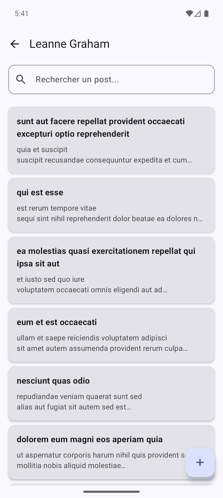
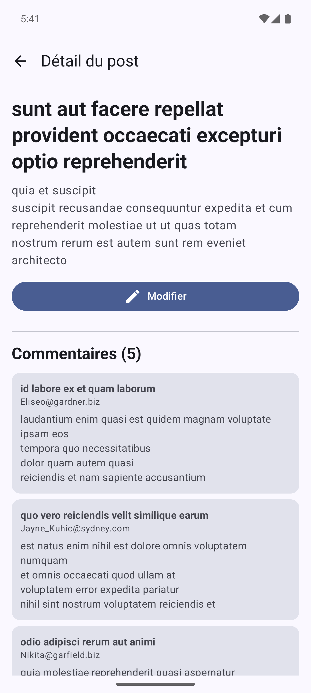

# BlogPostApp 📝

A modern Android application built to demonstrate **Clean Architecture**, **MVVM**, and the latest **Jetpack Compose** components. The app fetches data from the JSONPlaceholder API and provides a seamless user experience for browsing users, posts, and comments.

## 📸 Screenshots

<p align="center">
  
  
  
</p>

## 🚀 Features

-   **User Directory:** Browse a list of users fetched from the API.
-   **User Posts:** View all blog posts authored by a specific user.
-   **Post Details:** Dive deep into a post's content and see all associated comments.
-   **Offline Support:** Powered by **Room Database**, the app caches data locally for offline viewing.
-   **Post Management:** Edit existing posts via an intuitive dialog interface.
-   **Responsive UI:** Fully built with **Jetpack Compose** and **Material 3** for a modern, fluid experience.
-   **Error Handling:** Robust error states and retry mechanisms for network failures.

## 🛠 Tech Stack

-   **Language:** [Kotlin](https://kotlinlang.org/)
-   **UI Framework:** [Jetpack Compose](https://developer.android.com/jetpack/compose)
-   **Architecture:** Clean Architecture (Data, Domain, Presentation Layers) + MVVM
-   **Dependency Injection:** [Koin](https://insert-koin.io/)
-   **Networking:** [Ktor Client](https://ktor.io/docs/client.html)
-   **Local Database:** [Room](https://developer.android.com/training/data-storage/room)
-   **JSON Serialization:** [Kotlinx Serialization](https://github.com/Kotlin/kotlinx.serialization)
-   **Asynchronous Programming:** [Coroutines](https://kotlinlang.org/docs/coroutines-overview.html) & [Flow](https://kotlinlang.org/docs/flow.html)
-   **Image Loading:** (Coil)
-   **Navigation:** [Compose Navigation](https://developer.android.com/jetpack/compose/navigation)

## 🧪 Testing

The project includes unit tests for different layers:
- **Mappers:** Ensuring correct data transformation between DTOs, Entities, and Domain models.
- **Use Cases:** Testing business logic in isolation.
- **ViewModels:** Testing UI state management and search filtering using **Turbine** and **MockK**.

To run the unit tests, use the following Gradle command:
```bash
./gradlew test
```

## 🏗 Architecture

The project is structured following Clean Architecture principles:

-   **`:app` (Main Module)**
    -   `data/`: Implementation of repositories, API services (Ktor), and Local Database (Room).
    -   `domain/`: Business logic, Repository interfaces, and Use Cases.
    -   `presentation/`: UI components (Compose), ViewModels, and Navigation.
    -   `di/`: Dependency Injection modules.

## 📡 API Reference
This app uses the [JSONPlaceholder](https://jsonplaceholder.typicode.com/) API:
-   `/users`: Fetch user list.
-   `/posts?userId={id}`: Fetch posts for a specific user.
-   `/comments?postId={id}`: Fetch comments for a specific post.
---